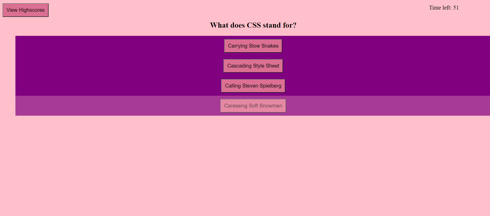

# coding-quiz

This is a basic quiz on very basic terms and concepts of coding. The quiz is also timed and will penalize you if you make a mistake. Your score is based on how much time you have left, if you get a question wrong, then time is deducted from the total, thus affecting your score. The instructions will give more detail on how it exactly affects your score once you click the deployed link. Are you ready to test your knowledge?

## Getting Started

To start simply click the deployed link below and begin! I cannot give you hints or answers! You can record your score at the end!

## Built With

* [HTML](https://developer.mozilla.org/en-US/docs/Web/HTML)
* [CSS](https://developer.mozilla.org/en-US/docs/Web/CSS)
* [Git](https://git-scm.com/about)
* [Github](https://github.com/)

## Deployed Link

* [See Live Site](https://eajayd.github.io/coding-quiz/)

## Preview

## Authors

* **Eajay Delos Santos** 

    - [Link to Github](https://github.com/EajayD)
    - [Link to LinkedIn](https://www.linkedin.com/in/eajay-delos-santos-912950214/)

## Acknowledgments

* w3schools
* Stackover flow threads helped me figure out the way I wanted to express my code in a way that I could understand myself
* Our class repository for allowing me to go back and reference the methods used and how I could apply them
* Unfortunately I didn't have help from my classmates this HW assignment but I'd like to aknowledge the ones that are left and ready to stick out the rest of the ride with me. 